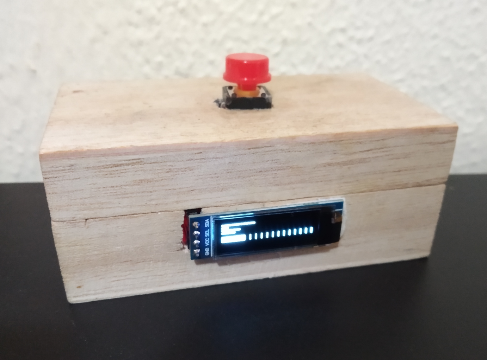

# yombcpu
Host CPU and memory monitor with a microcontroller and an i2c screen.

The OLED i2c screen shows up to 32 CPU usage values and the memory usage.

The user button toggles on/off the host display and Arduino display.

Here you see it connected to a 4 CPU host:



And open:


See the source files ```yombcpu.js``` and ```firmware/src/main.cpp``` for more documentation.

The serial port name and baud rate used to communicate with the Arduino is at the beginning of ```yombcpu.js```

### License

This program is Open Source, made available with the MIT license.

### Installation

```
git clone https://github.com/yomboprime/yombcpu
cd yombcpu
npm install
```

### Usage

```
cd yombcpu
npm start
```

### Firmware programming

You will need [Platformio CLI program](https://docs.platformio.org/en/latest/core/installation.html) installed.

To build and upload the firmware:

```
cd yombcpu/firmware
platformio run -t upload
```
